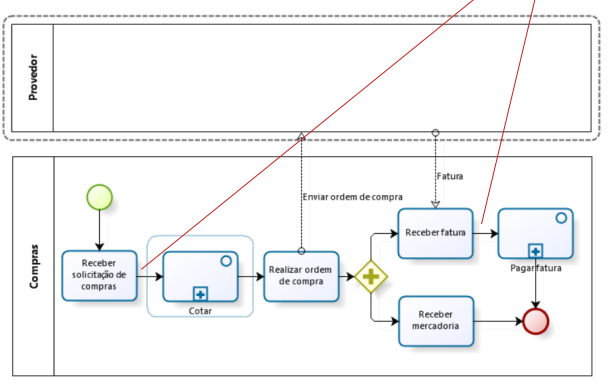
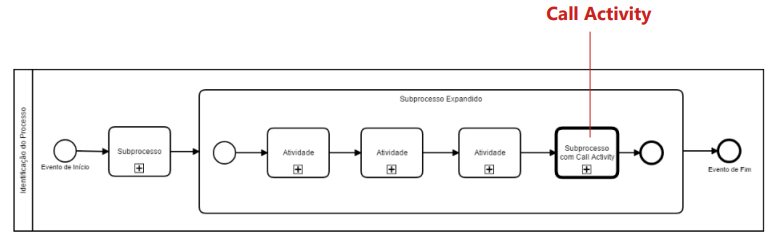

# BPMN

## Considerações Iniciais

Notação padronizada para diagramação de fluxos chamada Business Process Management Group (OMG). Sendo uma Notação de Gereciamento de Processos de Negócio.

- *Business Process Management Notation* (BPMN)

## Notação BPMN

### Principais Abstrações

- PISCINA/POOL
- RAIA/LANE
- FASE/MILESTONE
- CONECTORES
- ATIVIDADES
- SUB-PROCESSOS
- CALL ACTIVITY / REUTILIZÁVEL
- EVENTOS
- GATEWAYS
- ITEMS E DADOS

#### Piscina / Pool

Container que representa graficamente um participante em um processo.

- <u>Comumente</u>, um dado processo de negócio está contido em uma única piscina

#### Raia / Lane

Sub-partição de um processo. <u>BPMN não especifica exatamente o uso de raias.</u>

- Comumente, utilizada para organizar e categorizar atividades dentro do mesmo.

#### Fase / Milestone

É uma subdivisão de uma pool.

- Normalmente, representando uma fase do processo ou um período de tempo determinado...

#### Conectores

Elementos utilizados para mostrar a ordem de sequenciamento das atividades e dos eventos que ocorrem em um fluxo de trabalho.

- Cada conector tem apenas uma fonte e um alvo.
- Podem ser utilizados para definir o caminho principal de execução  de um processo.
- Temos 3 tipos de conectores:
    - Fluxo de sequência
    - Fluxo de mensagem
    - Associação

##### Exemplos de aplicação dos CONECTORES:

#### Atividades

Representam pontos de processo, nos quais algum trabalho é realizado.

- Possuem vários tipos de atividaes, mas geralemente é utilizado o **NONE**.

#### Sub-processos

É uma "atividade" que tem em seu interior a modelagem de outras ativdiades.

- Um dos tipos de sub-processos mais comum é o **Embutido**. Sendo um sub-processo em visão contraída.

- Sub-Processo com ciclo: **Muito utilizado**

#### Call Activity / Reutilizável

Pode ser entendido como um sub-processo, mas que não tem dependência com o processo pai.

- É uma referência a um Subprocesso ou atividade definida globalmente e reutilziada no processo atual.

#### Eventos

É um sub-processo especializado, sendo que esse não parte de um fluxo normal do processo pai. além de nao ter entradas nem saídas do fluxo de trabalho.

#### Gateways

Utilizados para controlar como o fluxo de sequência seguirá seu caminho **(convergência ou divergências)**

- Só é necessário, caso haja necessidade de controlar o fluxo.
- Atua como mecanismo de porta, permitindo ou não a passagem do TOKEN por um determinado caminho.

#### Itens e Dados

Utilizados para representar informações e itens físicos, e até armazenagem.

