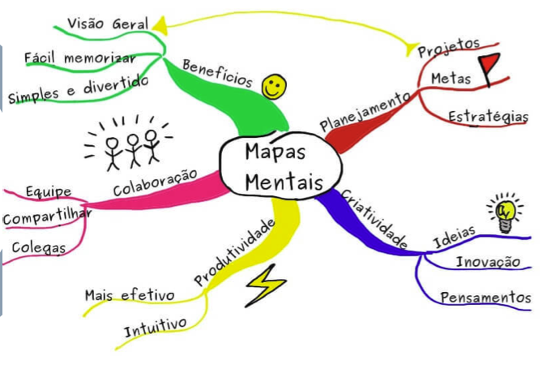

# Contextualizando com Engenharia de Requisitos

Tudo começa na E.R 

## Desenho de Software

- Núcleo técnico da engenharia de software.

Basicamente, elementos do modelo de análise (Ex.: Casos de uso), fornecem insumos para criação dos modelos de especificações de projeto.

## Desenho de Software

- Define o que é a solução (Arquitetônico)
- Define como é a solução (Projeot Lógico). Como cada componente deve ser implementado.

 

- Engenharia de Requisito:
    - Modelagem do **PROBLEMA** (Entender)
    - Qual o problema?
    - Como ele ocorre?
    - **Mundo Real**

- Desenho de Software
    - Modelagem da **SOLUÇÃO** (Criar)
    - Qual é a solução?
    - Como ela ocorre?
    - **Mundo Computacional**

## 5W2H
- What?
- Why?
- Who?
- Where?
- When?
- How?
- How much?

Exemplo:

 

## Rich Picture
- Diagrama Causa-Efeito
- Ishikawa

## Brainstorm

## Glossário
- Ligado à Definição.

## Léxico
- Definição + Ação
- Verbo, Objeto, Estado

| Tipo | Noção | Impacto |
|------|-------|---------|
| Verbo| Quem realiza, quando acontece e quais os procedimentos envolvidos |  Quais os reflexos da ação no ambiente e quais os novos estados decorrentes |
Objeto | Definir o objeto e identificar outros objetos com os quais se relaciona | Ações que podem ser aplicadas ao objeto |
Estado | O que significa e quais ações levaram a esse estado | Identificar outros estados e ações que podem ocorrer a partir do estado quie se descreve |

## Tratando Sofware como **<ins>PRODUTO</ins>**!

- No sentido de <ins>estimativas</ins>
    - Tempo, esforço, cronograma, custo ...

## Design Sprint

- MAP
    - Coletar o maior número de informações possíveis
    - Big Picture (Sugestão)
- ESBOÇO
    - Fazer desenhos de várias ideias
    - Rich Picture
- DECIDE
    - Qual será a solução?
    - Rich Picture final
- STORYBOARD
    - Ou protótipo (Ex.: FIGMA)
    - Já é possível validar, protóticpo agrega demais e tem muito valor para os stakeholders.
- ANÁLISE (VALIDAÇÃO)
    - Usa personas (para identificar usuários)
    - checklists
    - Questionários

# Processos & Metodologias & Abordagens

## RUP

- É um processo, foi o primeiro de todos. Foco em equipes grandes, pois exige muita documentação.
- Separado por disciplinas para desenvolvimento **COMPLETO** do software. Desde UX, Implementação, e gestão de risco.

Possui 4 fases, sendo elas:

- Concepção
- Elaboração 
- Construção 
- Transição

Sendo bem completo em todas as fases.

## OpenUP

Baseado no RUP, mas com uma pegada mais **ágil**, bem como os princípios do [Lean Inseption](https://caroli.org/en/lean-inception-4/).

- Microincrementado. (Days).
- Interação (Weeks).
- Projeto (Months).

 

- Equilibrar prioridades
- Arquitetura
- Ciclos
    - Iniciação -> Elaboração, contrução e transição

## Metodologias Ágeis (Scrum)

Criado para melhorar a gestão de projetos, promovendo flexibilidade, colaboração e adaptação constante.
- Transparência
- Inspeção
- Adaptação

Possui 4 fases:

| Fase | Propósito | Resultado |
|------|-----------|-----------|
| **Planning** | Definir escopo da iteração, quais itens serão entregues do backlog | Um backlog possivelmente **refinado**, junto a um plano inicial de como será ao longo |
| **Daily** | Reportar diariamente o progesso individual da equipe, o que foi feito dia anterior e possíveis impedimentos | Resolver esses posíveis impedimentos e incentivar a comunicação do time |
| **Review** | Apresentar o incremento de produto desenvolvido na sprint, com inspeção, feedback e talvez adaptação de backlog| Demonstração do trabalho concluído, feedback dos stakeholders convertidos em novos itens do backlog |
| **Retrospective** | Refletir sobre o processo do time durante o Sprint, buscando pontos de melhoria, pontos de otimização | Plano de melhorias para a próxima Sprint, com ações baseadas nos aprendizados da equipe, visando a evolução contínua do processo de trabalho |

## Lean

Resultado das práticas e bons resultados do sistema Toyota, surgiu com esse objetivo de eliminar desperdícios, considerar propósitos claros, melhorar processos, entregar valor ao cliente.

### Princípios:

- Definição de valor
- Mapeamento do fluxo de valor
- Criar fluxo
- Estabelecer um sistema puxado
- Buscar perfeição

### Boas práticas:

- Identificar e eliminar desperdícios
- Focar na sarisfação do cliente

## Promodoro Technique

Objetivo de melhorar o desempenho em qualquer tipo de trabalho ou estudo. Utilizando as técnicas de:

- Dividir o trabalho em pequenos intervalos (**PROMODOROS**).
- 1 intervalo após o promodoro (Pausa curta).
- Após 4 promodoros uma pasua longa (15 a 30 min).

Exemplo:

- 25 min de trabalho focado.
- Pausa curta
- Repetição de trabalho
- Pausa longa

## Crystal Methodology

Baseado na gestão de pessoas. Dentre os **princípios**:

- Comunicação frequente 
- Adaptação contínua
- Entrega frequente
- Foco em pessoas

**Ciclos**:

- Exploration
- Planning
- Iteration
- Release

Ideal para pequenas/médias equipes, por conta da flexibilidade e menos burocracia (documentação).

## Atomic Desing

Uma abordagem modular e estruturada para desing de interfaces de usuários. Com objetivo de criar desing escaláveis, reutilizáveis e consistentes.

### Ciclo do atomic desing

- A interface é decomposta em seus elementos mais simples (átomos)
- Esses elementos são recompostos até formar uma interface completa (páginas)
- O processo é iterativo e contínuo, permitindo reufinamento a cada iteração e reuso dos componentes.

Separado em:

### Átomos

- Elementos básicos e indivisíveis da interface, como botões, campos de entradas e rótulos.

### Moléculas

- São grupos de átomos que juntos formam um componente menor, como bara de pesquisa ou campos de formulários

### Organismos

- São grupos mais complexos de moléculas e átomos que formam seções distintas da interface, como cabeçalhos ou cards de produtos

### Organismos com diferentes moléculas

Cada cabeçalho de um site é organizado em um organismoe nele pode-se encontrar **diferentes moléculas**, como:

- A **Barra de pesquisa** é uma molécula
- O **logotipo** do site, pode ser considerado uma molécula simples

### Organismos com moléculas semelhantes

Em sites de e-commerce, a disposição dos produtos são formados por moléculas de estruturas semelhantes.

### Templates

Layouts de página no nível de esqueleto, definindo estruturas onde os elementos reais serão colocados, porém sem conteúdo real.

### Pages

São instâncias específicas de templates com conteúdo real inserido, representando a **página final que o usuário verá**.

