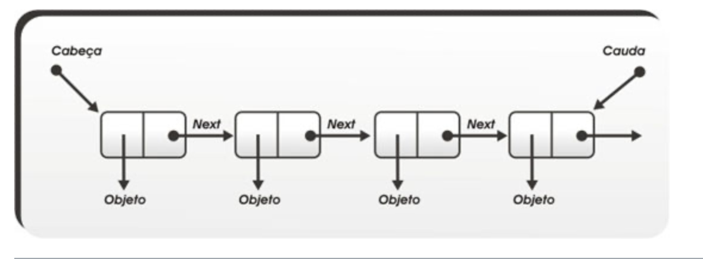

# Estruturas Lineares: Lista, fila e pilha

## Listas encadeadas

Numas lista encadeada, cada elemento aponta para o próximo, sem que estejam em posiçoes sequenciais na memória.

### 1. Listas encadeadas simples



Cada elemento aponta apenas para o que vem a seguir. Cada caixinha é chamada de nó ou célula e é implementada da seguinte forma:

```c
type def struct celula{
    int dado;
    struct celula *prox;
} celula;
```

Implementaremos listas simplesmente encadeadas com nó cabeça;

#### Criação da lista

```c
celula *cria_lista(){
    celula *le = malloc(sizeof(celula));
    le -> prox = NULL;
    return le;
}
```

> (*le).dado = 10, é a mesma coisa que le -> dado = 10

#### Busca

##### Busca Iterativa

```c
celula *busca(celula *le, int x){
    for(celula *ptr = le; ptr != NULL; ptr = ptr -> prox)
        if(ptr -> dado == x) return ptr;
    return NULL;
}
```

Fazendo alguns exercícios do MOJ, surgiu uma questão de implementar uma função de busca de forma recursiva. Dessa forma:

##### Busca Recursiva

```c
celula *busca_rec(celula *le, int x){
    if (le == NULL) return NULL;
    if ( le -> prox == x) return le;

    return busca_rec(le->prox, x);
}
```

#### Inserção 

```c
void insere(celula *ptr, int x){
    celula *novo = malloc(sizeof(celula));
    novo -> dado = x;
    novo -> prox = ptr -> prox;
    ptr -> prox = novo;
} // COMPLEXIDADE: O(1)
```

Para inserir no começo, basta chamar <u>insere</u> com le. Para inserir depois de um elemento y da lista, basta chamar busca e com seu retorno, chamar insere.

#### Remoção

```c
int remove(celula *ptr){
    celula *lixo = ptr -> prox;
    celula *proxNo = lixo -> prox;
    int x = lixo -> dado;
    ptr -> prox = proxNo;
    
    free(lixo);
    return x;
}
```

> Para remover o primeiro elemento da lista, chama-se remove com le.

Agora para exercitar, pense: 

- Como remover um elemento y?

    - Estive estudando, e o princípio é. Temos que saber a celula anterior a que queremos saber, e fazer essa anterior apontar para a que ela aponta. Dessa forma:

    ```c
    int removeItem(celula *le, int x){
        for ( celula *atual = le; atual != NULL; atual = atual -> prox){
            if ( atual -> prox -> dado == x){
                celula *to_remove = atual -> prox;

                atual -> prox = to_remove -> prox;

                free(to_remove);

                return 1;
            }
        }
        return 0; // 0 se n econtrou
    }
    ```

- Como remover o último elemento da lista?
    - Podemos seguir do mesmo jeito, achamos o último elemento que aponta para NULL, pegamos o antecessor e apontamos para NULL;
    ```c
    int removeUltimo(celula *le){
        if(le -> prox == NULL) return 0; 

        for (celula *atual = le; atual != NULL; atual = atual -> prox){
            if ( atual -> prox -> prox == NULL) {
                free(atual->prox);
                atual -> prox = NULL;
                return 1;
            }
        }
        return 0;
    }
    ```


#### Destroi lista

```c
void destroi_lista(celula *le){
    while(le -> prox != NULL)
        remove(le);
    free(le);
} // COMPLEXIDADE: O(n)
```

## Pilhas

São estruturas do tipo **LIFO (Last-In-Fist-Out)**. Tem dois jeitos de fazer uma pilha, usando:

- Vetores
- Listas Encadeadas

Usando listas encadeadas é praticamente a mesma forma de implementar uma lista. Então vou implementar uma usando vetores.

### Pilhas com Vetores

```c
type def struct {
    int *dado;
    int n; // tamanho
    int topo;
}pilha
```

#### Criacao da pilha

```c
pilha *cria_pilha(int tam){
    pilha *p = malloc(sizeof(pilha));
    p -> dado = malloc(tam * sizeof(int));
    p -> n = tam;
    p -> topo = 0;
    return p;
}
```

#### Empilha

```c

    int empilha(pilha *p, int x){
        if(p -> topo == p -> n){
            p -> dado = realloc(p -> dado, 2 * p -> tam * sizeof(int));
            if(p -> dado == NULL) return 1; // Estouro
            p -> n *= 2;
        }
        p -> dado[p -> topo++] = x;
        return 0; // bem sucedido
    } // O(1)

```

#### Desempilha

```c

    int desempilha(pilha *p, int *y){
        if(p -> topo == 0) return 1; //erro
        p -> topo--;
        *y = p -> dado[p -> topo];
        return 0;
    } O(1)

```

#### Destroi pilha

```c

    void destroi_pilha(pilha *p){
        free(p->dado);
        free(p);
    }

```

## Fila

São estruturas do tipo **FIFO (First-In-First-Out)**. Tem dois jeitos de fazer uma fila, usando:

- Vetores 
- Lista encadeada

### Por meio de vetores

Vou mostrar a implementacao via vetor, mas o indicado é sempre por lista esncadeada para nao se preocupar com redimensionamento.

```c
type def struct{
    int *dado;
    int s, e; // start e end
    int n; // tamanho
}
```
 
#### Criar fila

```c
fila *cria_fila(int tam){
    fila *f = malloc(sizeof(fila));
    f -> dado = malloc(tam * sizeof(int));
    f -> s = f -> = 0;
    f -> n = tam;
    return f;
}
```

#### Insere na Fila

```c
int enfileira(fila *f, int x){
    if ((f -> e+1)%f -> n == f -> s) if (redimensiona(f)) return 1;
    f -> dado[f -> e] = x; f -> e++;

    return 0; // deu certo
}
```

#### Remove da Fila

```c
int desenfileira(fila *f, int *y){
    if (f -> e == f -> s) return 1; // vazia
    *y = f -> dado[f -> s];
    f -> s++;
    return 0; // deu certo
}
```
