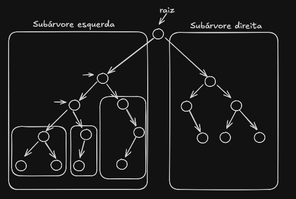
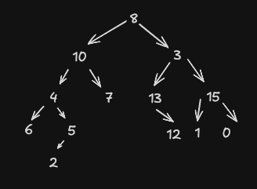
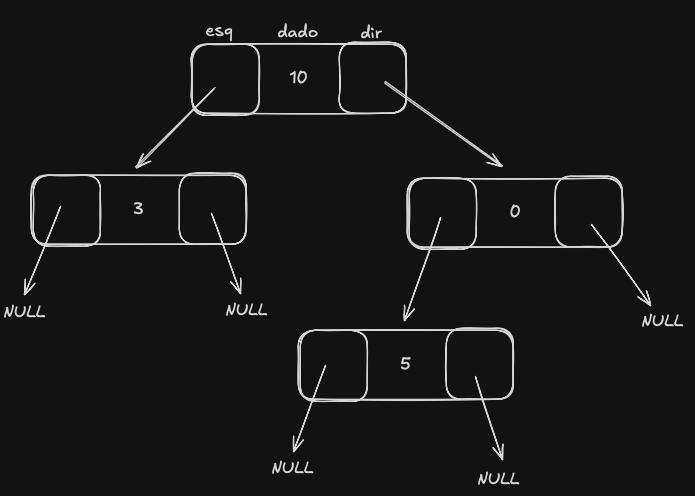
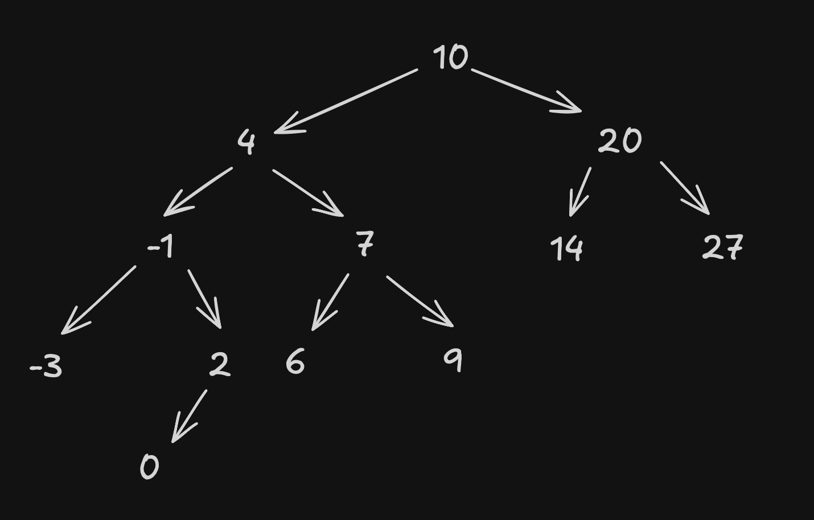
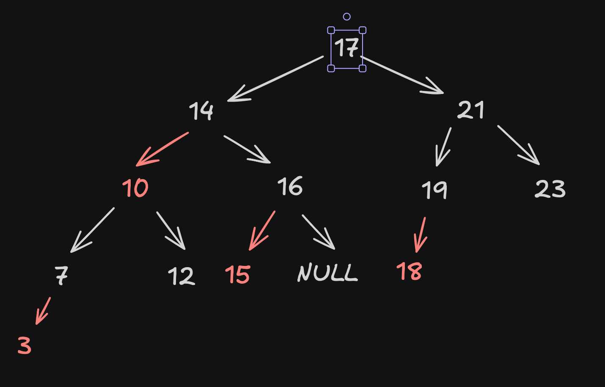

# Árvore

Uma árvore é um conjunto de <u>nós</u> interligados de tal forma que existe apenas um único caminho ente quaisqier dois nós da árvore. Toda árvore é dotada de <u>estrutura topológia</u>: Raiz, e rodem dos filhos.

- Todo nó sem filhos é chamado de folha. Dizemos que a **altura** de um nó é o tamanho de um caminho (qtde de arestas) à folha descendente mais distante.
- Dizemos que a **profundidade** de um nó é a distância (tamanho do caminho) à raiz da árvore.
- Dizemos que uma árvore cujos nós possuem no máximo dois filhos é uma árvore binária.

## Definição recursiva



## Percursão numa AB (Árvore Binária)

1. Percursão em profundidade
    - Pré-ordem
    - Em ordem
    - Pós-ordem

## Percurso em Profundidade



### Implementação

Tipo abstrado de dados (TAD)



Código em C, mas a estrutura é assim em outras linguagens tambem.

```c
typedef struct celula {
    int dado;
    struct celula *esq, *dir;
}celula;

celula *cria_arvore(int x){
    celula *raiz = malloc(sizeof(celula));
    raiz -> esq = NULL;
    raiz -> dir = NULL;
    raiz -> dado = x;

    return raiz;
}

celula *preOrdem(celula *raiz){
    if(raiz != NULL){
        printf("%d ", raiz -> dado);
        preOrdem(raiz-> esq);
        preOrdem(raiz-> dir);
    }
}

celula *preOrdemInte(celula *raiz){ // De forma iterativa
    pilha *p = cria_pilha();
    empilha(p, raiz);
    while(!pilha_vazia(p)){
        raiz = desempilha(p);
        if(raiz -> dir != NULL) empilha(p, raiz -> dado);
        if(raiz -> esq != NULL) empilha(p, raiz -> dado);
        printf("%d ", raiz -> dado);
    }
}
```

Como encontrar a altura de uma árvore?

```c
int altura (celula *raiz){
    if (raiz != NULL){
        int he = altura(raiz -> esq);
        int hd = altura(raiz -> dir);

        if(he > hd) return he + 1;
        else return hd + 1;
    }
    else return 1;
}
```

## Árvore Binária de Busca (ABB)

Uma ABB é uma árvore binária tal que, para todo nó x: $e \leq x \leq d$. Para qualquer e pertencente à subárvore esquerda de x e qualquer pertence a subárvore diretira de x.

### Busca Árvore Binaria

```c
celula *busca(celula *raiz, int x){
    if(raiz != NULL){
        if(raiz -> dado > x){
            return busca(raiz -> esq, x);
        }else if (raiz -> dado < x){
            return busca(raiz -> dir, x);
        }
    }
    return raiz;
}

celula *buscaInt(celula *raiz, int x){ // de forma interativa
    while(raiz != NULL && raiz -> dado != x){
        if(x < raiz -> dado) raiz = raiz -> esq;
        else raiz = raiz -> dir;
    }
    return raiz;
}
```

### Função maximum 

```c 
celula *maximo(celula *raiz){ // Interativamente
    if(raiz != NULL){
        while(raiz -> dir != NULL) {
            raiz = raiz -> dir;
        }
    }
    return raiz;
}

celula *maximoRec(celula *raiz){
    if(raiz != NULL & raiz -> dir != NULL){
        return maximo(raiz -> dir);
    }
    return raiz;
}
```

> Implementar função mínimo

### Antecessor e Sucessor

- Antecessor: É o maior elemento da subárvore esquerda, ou o primeiro ancestral à esquerda (na "subida")
- Sucessor: É o maior elemento da subárvore direita, ou o primeiro ancestra à direita ("na subida")

```c
celula antecessor(celula *no){
    if ( no -> esq != NULL){
        return maximo(no -> esq);
    }else{
        return ancestral_a_esq(no);
    }
}

celula antecessor_a_esq(no -> pai);
```

### Insere

```c
celula *insere(celula *raiz, int x){
    if ( raiz != NULL){
        if (x < raiz -> dado){
            raiz -> esq = insere(raiz -> esq, x);
        }else if(x > raiz -> dado){
            raiz -> dir = insere(raiz -> dir, x);
        }
        return raiz;
    }else{
        celula *novo = malloc(sizeof(celula));
        novo -> esq = novo -> dir = NULL;
        novo -> dado = x;
        return novo;
    }
}
```

### Remoção 



1. Se for **FOLHA**, basta remover.
2. Se tiver só uma subárvore (esq ou dir) basta concertar ao nó pai.
3. se houver subárvores a esquerda e direita, troco o calor do nó com seu antecessor e remove o nó que era antecessor pelos casos 1 ou 2.
- Com essa troca, a árvore continua ABB
- Antecessor não possui filho direito

```c 
celua *remove(celula *raiz, int x){
    if (raiz != NULL){
        if(x < raiz -> dado)
            raiz -> esq = remove(raiz -> esq, x);
        else if (x > raiz -> dado)
            raiz -> dir = remove(raiz -> dir, x);
        else{
            if(raiz -> esq == NULL){
                celula *ret = raiz -> dir;
                free(raiz);
                return ret;
            }
            else if(raiz -> dir == NULL){
                celula *ret = raiz -> dir;
                free(raiz);
                return ret;
            }else
                remover_antecessor(raiz);
        }
    return raiz;
}

void remover_antecessor(celula *raiz){
    celula *pai = raiz;
    celula *max = raiz -> esq;
    while(max -> dir != NULL){
        pai = max;
        max = max -> dir;
    }

    raiz -> dado = max -> dado;

    if(max == pai -> esq)
        pai -> esq = max -> esq;
    else
        pai -> dir - max -> esq;
    
    free(max);
}
```

## Árvore Binária de Busca - Rubro Negro Esquedista

É uma ABB que:

1. Todo nó é vermelho ou preto
2. A raiz é preta
3. As folhas são NULL e tem cor preta
4. Se um nó é vermelho:
    - É filho esquerdo de um nó preto
    - Seus filhos são pretos
5. Para todo nó, o caminho até uma folha descendente te ma mesma quantidade de nós pretos
    - Chamamos de **altura negra** de nó

Exemplo:



Seja <u>bh</u> a <u>altura negra</u> da árvore e h a <u>altura da árvore</u>

- ABB possui pelo menos $2^{bh} - 1$ nós
- A altura h de uma ABB-RNE é, no máximo, o dobro da altura negra bh. ($h \leq 2 \dot bh$ => $bh = \frac{h}{2}$) 

### Inserção

Todo novo nó numa ABB-RNE possui inicialmente a cor vermelha. Ao inserir um novo nó numa ABB-RNE, podemos ter os seguintes cenários com o novo nó:

1. Filho esquero de um nó preto. (Irmão preto)
2. Filho direito de um nó preto.
    - 2.1 Irmão vermelho
    - 2.2 Irmão preto
3. Filho esquedo de um nó vermelho (Irmão e vô preto)
4. Filho direito de nó vermelho (Irmão preto)

