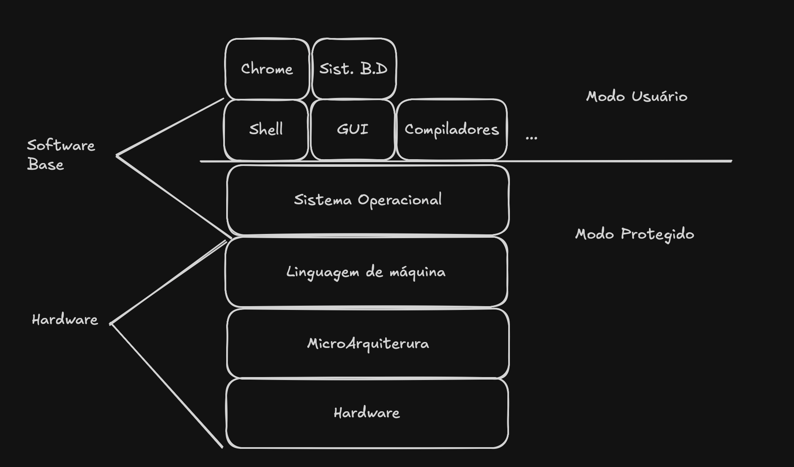
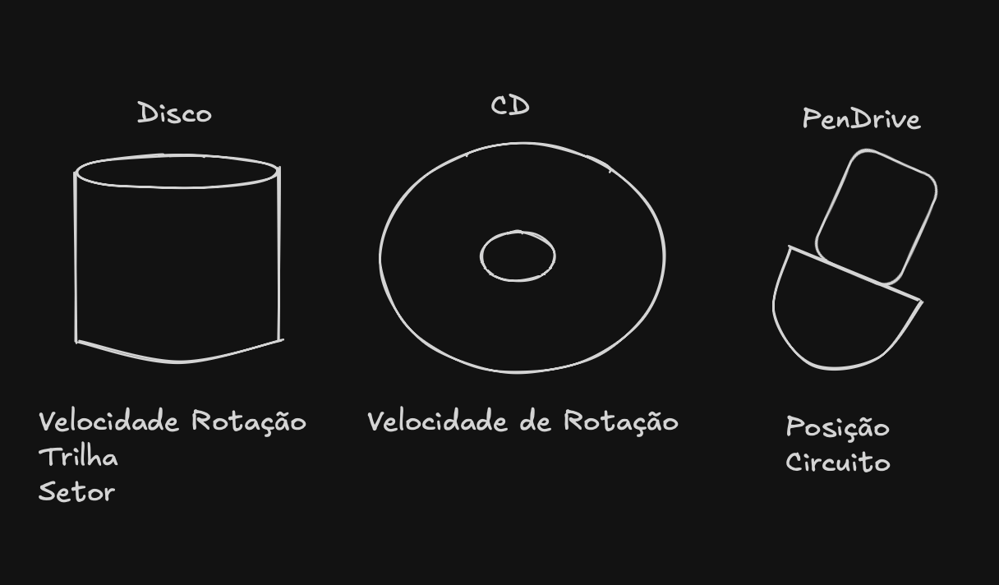
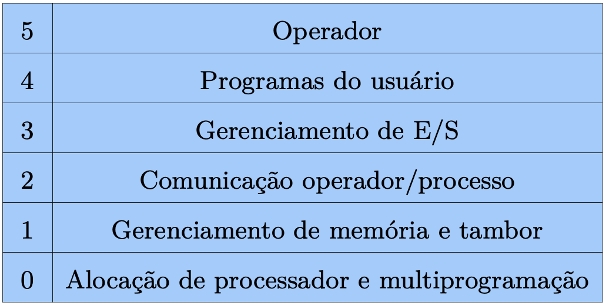
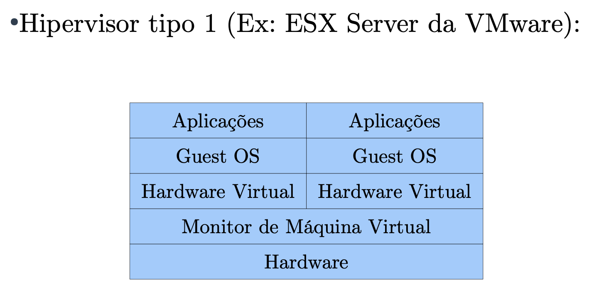

# Conceitos iniciais para FSO

Portanto a definição de Sistema Operacional mais correta, seria aquele que roda somente em modo protegido. Esse modo protegido é onde somente o sistema consegue executar comandos por exemplo de gravação em disco.

## Maquina Estendida ou Abstrada

Programar, gravar em diferentes tipos de discos é MUITO complicado. Portanto, os sistema cria essa máquina abstrata de forma que facilita bastante, por exemplo, tranforma o disco em arquivos, memoria ram em endereço etc.

## Gerenciador de Recursos (RAM)

- Alocação -> `malloc`

- Liberação -> `free`

- Proteção -> Estudaremos a fundo posteriormente.

## Gerações de Computadores

Ao total temos 5 gerações, estamos vivendo a quarta e a quinta.

### Primeira Geração de Computadores (1945 - 1955)

Computador criado por Alan Turing durante a segunda guerra mundial, onde funcionava com válvulas (300 válvulas)

- Toda programação era em linguaguem de máquina ou diretamente nos circuitos

### Segunda Geraçã de Computadores (1955 - 1965)

- Tivemos a substituição das válvulas por transistores, como é até hoje, porém com evoluções.
- Primeira vez que houve diferença de papéis, como, construtores, programadores etc...
- Execução de tarefas por meio de furo em cartões
- Observou-se que perdia muito tempo com essa leitura e impressão em cartões e com a locomoção dentro da sala, devido ao tamanho enorme dos computadores.
- Aqui surgiu um conceito muito importante, utilizado até hoje, o conceito de <u>BATCH</u>, sistemas em lote, utilizado em super computadores atualmente.

### Terceira Geração de Computadores (1965 - 1980)

- Computadores orientados a caracteres
- Grandes computadores eram orientados a palavras (ocupavam salas **inteiras**)
- IBM inovou com o System/360, com máquinas que possuiam software compativéis
- Introduziram um conceito fundamental a **Multiprogramação**
- Conteito de Spooling também veio, sendo a técnica que permite acesso a dispositivos muitos lentos, armazenando temporariamente em uma memória secundária. (Técnica usada em impressoras até hoje)
- **Timesharing** Usuários poderiam compartilhar a CPU e recursos, cada um deles com direito de usar uma fatia de tempo, usado ate hoje, com a definição de 100ms de fatia de tempo
- **MULTICS** -> Pai dos sistemas operacionais de hoje

### Quarta Geração de Computadores (1980 - ATUAL)

- Desenvolvimento em larga escala (LSI)
- Houve Popularização de computadores pessoais
- IBM no mercado de microcomputadores
- Intel surge como grande referência como fabricante de processadores
- Primeiras interfaces gráficas, como Windows

### Quinta Geração de Computadores (2010 - ATUAL)

- NOKIA surge como fabricante, de forma muito influente
- Apple e Google dominam os smartphones
- Conceitos em SO nao mudaram com essa geração

## Classificação de Sistemas Operacionais

- Sistemas Monoprogramáveis
- Sistemas Multiprogramáveis
- Sistemas com Múltiplos Processadores

### Monoprogramáveis

- Voltado à execução de um único programa
- Raiz nos computadores dos anos 60

### Multiprogramáveis

- Permite recursos computacionais sejam compartilhados entre vários usuários e dispositivos.

Então surge alguns sistemas para apoiar, sendo eles.

- Sistemas Batch, onde se caracteriza por não exigir interação com usuário
- Sistemas de Tempo, Caracterizado pela gerência de processos
- Sistemas em Tempo Real, Como por exemplo de Controle Áereo

### Múltiplos Processadores

- 2 ou mais processadores interligados
- Vários programas rodando ao mesmo tempo

## Sistemas Operacionais Usuais

- S.O Computadores pessoais
- S.O de Servidores
- S.O de Embarcados

### S.O Computadores Pessoais

- Voltados a uso simultâneo de apenas 1 usuário por vez
- Windows, Linux: Ubuntu, Fedora

### S.O de Servidores

- Objetivo é servir o maior número de usuários ao mesmo tempo
- Windows Server, Linux: CentOS, Red Hat

### S.O de Embarcados

- Voltados para dispositivos que não aparentam ser um computador (TV, Micro-Ondas, Celulares, Smartphones)
- PalmOS, Windows CE, Android, IOS, Windows Phone

## Estutura de Sistemas Operacionais

- Sistemas Monolíticos
- Sisemas em Camadas
- Micro-Kernel
- Máquinas Virtuais
- Exo-Kernel
- Conteiners

### Sistemas Monolíticos

- Organização de SO mais comum
- S.O roda em modo protegido, o resto em modo usuário
- Melhor organização para tempo de resposta
- Todos os procedimentos do núcleo são visíveis a todos os outros
- Necessitam de "Módulos de Kernel", dados que são inseridos pelo ROOT no Kernel

### Sisemas em Camadas

- Organizado em camadas funcionais
- Cada camada faz chamada a camada inferior 

### Micro-Kernel

- Maior parte do SO, implementada a nível de usuário (processos clientes)
- Falhas em um servidor de arquivos não afeta o kernel
- Alta adaptabilidade a sistemas distribuídos
- Difícil implementação, mas relativa popularidade no meio

### Máquinas Virtuais

- Os sistemas operacionais estruturados como máquinas virtuais possuem, no mais baixo nível, um monitor de máquina virtual, inclusive é feito via Hardware.
- Em cima do monitor, várias máquinas virtuais podem ser utilizadas

### Exo-Kernel

- Uma outra estratégia é dividir: uma máquina virtual recebe blocos de disco de 0 a 1023 e a outra de 1023 a 2047
- Desta forma, inserimos um software em modo protegido que apenas garante que os recursos são divididos entre os usuários
- Expõe o hardware às aplicações / ao espaço de usuário

### Conteiners

- Um concorrente das máquinas virtuais são os contêineres (Ex: Docker, Podman).
- Frequentemente, utiliza-se máquinas virtuais para isolar as aplicações em execução na mesma máquina
