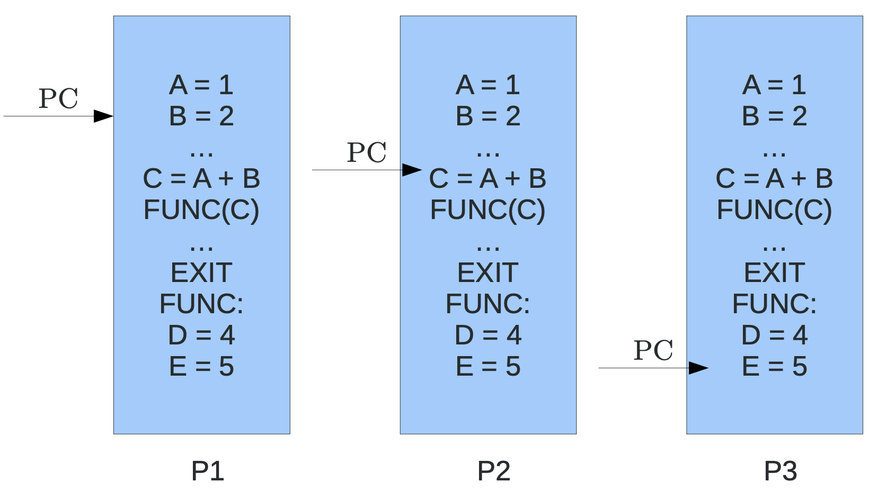
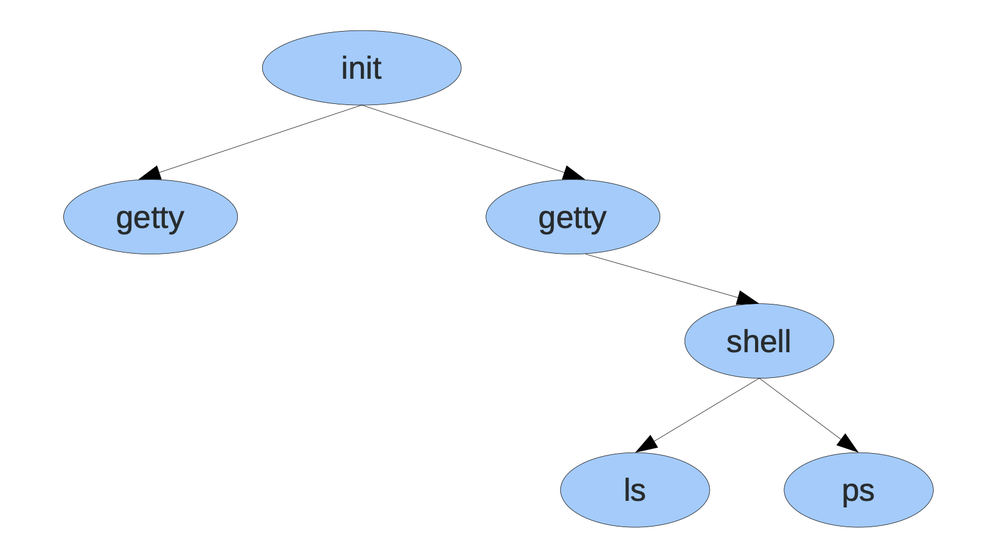
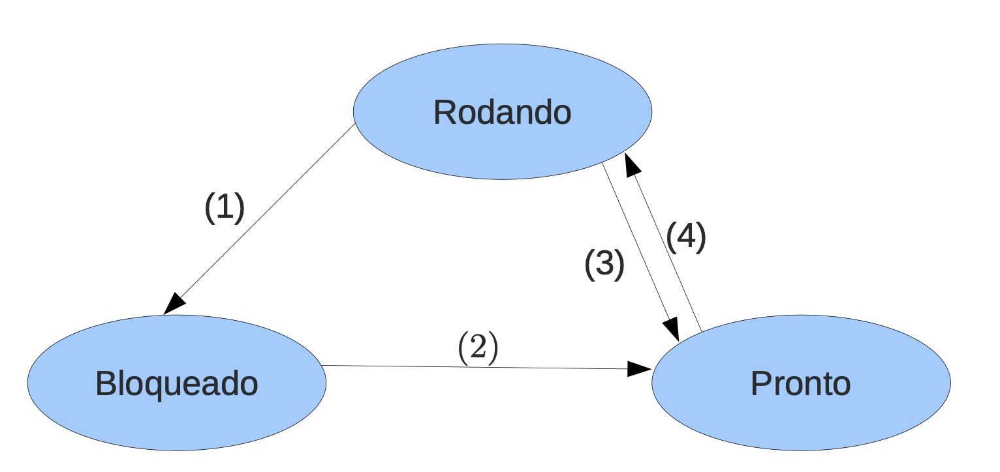
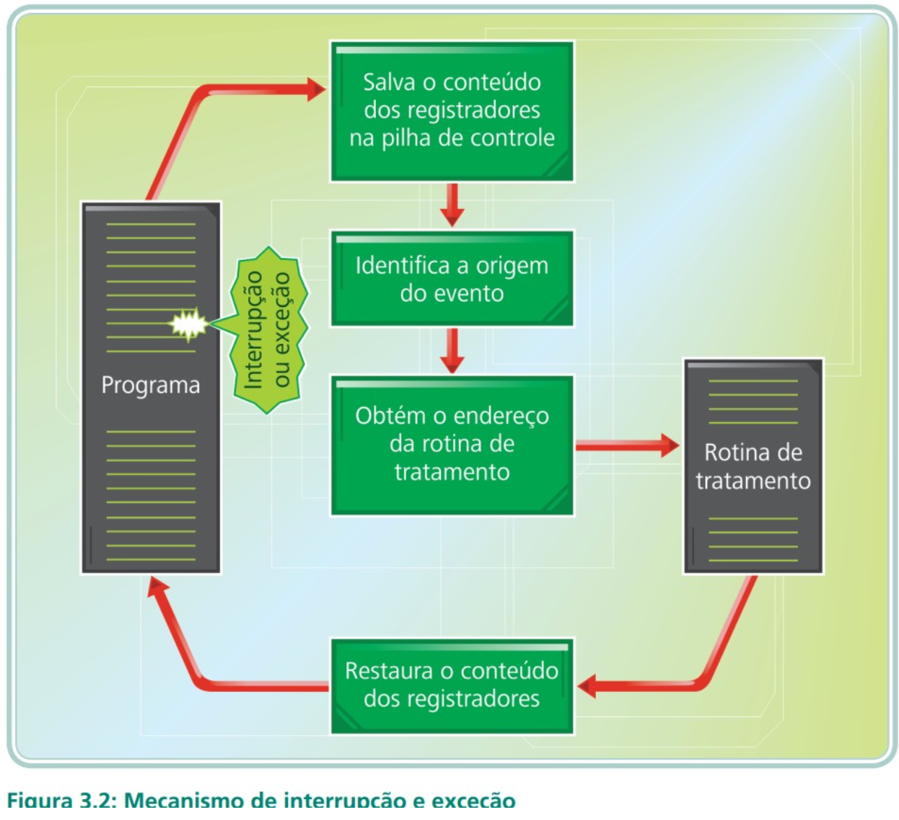
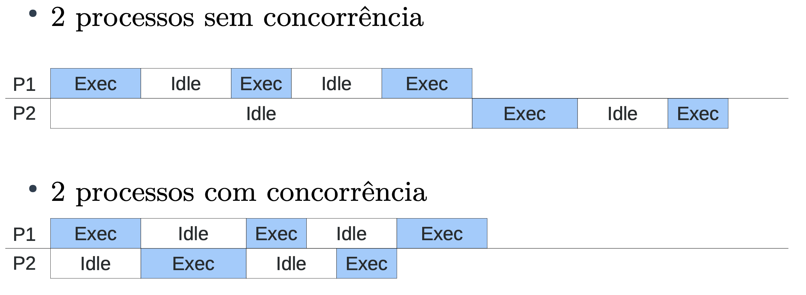

# Processos

## Modelo de processo

- Conceito: É um programa em execução acompanhando de valores de tempo de execução

- Processo:
    - Código executável
    - Valores de variáveis locais
    - Registradores
    - Contador de programa (indica a próxima tarefa a ser executada)

- Diferença de processo e programa: Programa é receita de bolo, processo é o ato de fazer o bolo.
    - Programa é uma série de passos a ser executado
    - Processo é a execução desses passos

- Um processo pode ser dividido em: Ambiente e Execução

- Machado e Maia dividem em 3 partes, Espaço de endereçamento, contexto de software e contexto de hardware:
    - Execução: Contexto de Hardware
    - Ambiente: Espaço de endereçamento + Contexto de software

### Classificação de processo

Classificação dos modelos de processos quanto ao custo de troca de contextos e de manutenção

- Heavyweight (Processo tradicional)
- Lightwheight (threads)

#### Heavyweight (Processo Tradicional)

- Processo composto tanto pelo ambiente como pela execução
- Cada processo possui um único fluxo de controle (contador de programa) e roda de forma independente
- Em um determinado instante, há vários processos ativos ao mesmo tempo, o processador é chaveado entre diversos processos

#### Lightwheight (threads)

## Criação de processos

- Sistemas de um único propósito possuem um esquema mais simples e previsível de processos em execução
- Os processos são criados:
    - Ínicio do sistema
    - Execução de uma chamada ao sistema de criação de processo em execução
    - Requisição do usuário
    - Ínicio de um job de lote
- Alguns executam em primeiro plano e interagem com usuários
- Outros executam em segundo plano: chamados de **daemons**
- Normalmente os processos são criados por outro.
- Em alguns sistemas, é possível listar o ppid (parent pid)
- Todos os processos são filhos ou descendentes do processo init
- Windows não apresenta hierarquia de processos

### Hierarquia da árvore

### Condiçoes de término de processo

- Sáida normal (voluntária)
- Saída por erro (voluntária)
- Erro fatal (involuntário)
- Cancelamento por outro processo (involuntário)

## Estados de processos

- Apesar de processos serem autossuficientes, muitas vezes necessitam acessar recursos ou comunicar com um processo
- Quando um processo espera um evento, dizemos que esta bloqueado
    - Leitura em disco
    - Leitura de rede
    - Esperando entrada do usuário

- Os processos podem estar:
    - Rodando
    - Bloqueado
    - Pronto

- (1) O processo bloqueia-se aguardando uma entrada
- (2) O evento aguardado pelo processo ocorreu, pode-se iniciar a executar.
- (3) O tempo de posse do processador esgotou-se
- (4) O processo é escolhido pelo escalonador para executar

## CPU Bound e I/O Bound

- CPU Bound possuem maior afinidade com o procesasdor, e passam a maior parte do tempo em estado rodando, já o I/O Bound possuem afinidade a entrada e saída, passam a maior parte do tempo em bloquado.

## Implementação de processos

- **TROCA DE CONTEXTO** : Operação básica da multiprogramação, é uma operação de salvamento dos registradores de um processo, para posteriormente restaurar esses regsitradroes, para que esse processo continue a execução como se não tivesse parado
-  

## Escalonamento de Processos

O algortimo de escalonameto é o que vai definir qual processo vai rodar e por quanto tempo.

- A parte do S.O que faz isso é chamado de escalonador

Daí surge a multiprogramação. Os escalonadores podem ser classificados em:

**Preemptivos**: Quando faz a suspensão temporaria de um processo, quando possui a capacidade de tirar a força da CPU.  
**Não-Preemptivos**:  Quando o processo chega a CPU, ele executa até o fim, não possui a capacidade de tirar a força da CPU.  

- Cada processo possui um tempo limitado no processador (time-slice)
- Os escalonadores não-preemptivos são de projetos mais simples, não confiáveis pois podem abusar do tempo limite da CPU. Isso viola bons critérios de um bom escalonador, justiça, tempo, etc.
- Escalonadores preemptivos asseguram um uso mais balanceado da CPU, por isso, são usados em maioria pelos S.O.
- Tais projetos podem possuir deficiência em processos concorrentes, devido a complexidade.

Ao projetar um escalonador deve-se levar em consideração:

- **Justiça**: Um bom escalondaro deve ser justo, todos os processos devem ter uma chance justa de usar o processador
- **Eficiência**: Quando houver um trabalho a fazer o processador deve estar ocupado
- **Minimizar o tempo de resposta**: Reduzir o tempo dos usuários interativos, quando se há diferente tipos de processos rodando na máquina.
- **Minimizar o turnaround**: Reduzir o tempo de processo até o seu término. Soma de tempo de espera por recursos.
- **Minimizar tempo de espera**: Visa minimizar o tempo de esepra pela CPU
- **Maximisar throughtput**: Maximizar o número de tarefas executadas por uma unidade de tempo

Não é possível atingir todos esses critérios com maestria em um algoritmo, é necessário uma lista de prioridade.

- Algoritmos clássicos de escalonamento:
    - Fist Come First Server
    - Round-Robin: Alternância circular, cada um vai usar um pouco
    - Prioridades
    - Shortest Job First

### First Come First Served

O processo obtido pela CPU de acordo com a ordem de chegada, é do tipo **não-preemptivos**, assim o processo obtem a CPU por um tempo inderteminado. 

- Vantagens: 
    - Simples de implementar
    - Algoritmo eficiente, CPU sempre utilizada
- Desvantagens:
    - Impossiblidade de prever quando um processo vai iniciar
    - Tempo médio de processo não é respeitado
    - Tempo de espera = Tempo de serviço - Tempo de chegada

- Justiça: Não. Um processo pode monopolizar
- Eficiência: OK. A CPU sempre é utilizada, se existe trabalho
- Minimizar o tempo de resposta: Não. Caso um processo monopolize
- Minimizar o turnaround: Tarefas longas sendo executadas primeiro, aumenta turnaround (Ver exemplo do SJF a frente)
- Minimizar waiting time: O tempo de espera não é considerado durante o escalonamento
- Maximizar throughtput: Se a primeira tarefa for longa, o tempo de término fica alta

### Round-Robin: Alternância circular, cada um vai usar um pouco

Cada processo tem o direito de usar o processador por um intervalo de tempo pre-definido.

- É uma dificuldade escolher o tempo do quantum, o tempo de execução, pois devo esperar um tempo maior que o tempo da troca de contexto, o tempo de resposta desejado. 
- O tempo de quantum padrão é de **100ms**
- Quantum muito longo, se torna um FCFS
- Quantum muito curto, perde vários requisitos, por exemplo eficiêcia

### Prioridades

Baseia-se no fato que alguns processos são prioritários e devem ser executados antes dos outros. Muito importante em Sistemas operacionais em tempo real. Cada processo é atribuido uma prioridade.
- Podem ser atribuidas de 2 formas:
    - **Estática**: Processos são divididos em classes e a cada classe é atribuida uma prioridade, a cada prioridade existe uma fila de prontos associadas
    - **Dinâmica**: O sistema analisa o comportamento dos processos e atribui prioridades favorecendo um certo tipo de comportamento. Processos I/O devem possui uma prioridade alta.
        - Prioridade dinâmica: 1/f, onde f é a fração do quantum de tempo de usada na última rodada do processo

### Shortest Job First

Algoritmo projetado para sistemas em lote, com objetivo de reduzir o tempo de turnaround (tempo de lançamento do processo até seu término). Entretando, requer que o tempo de execução de um processo seja conhecido antes de seu início.

- Possui aplicação para sistemas interativos

- Desvantagens:
    - Como determinar o tempo de execução do comando
    - Probelma da parada é indecidível
    - Necessário combinar técnincas para estimar valores baseados em execuções anteriores (aning)

## Escalonamento em dois níveis

