# Threads

- Threads separam conceitos de agrupamento de recursos e execução.
- Processos agrupam recusos
- Threads são escalonadas para execução
- Permitem que múltiplas execuções ocorram no mesmo ambiente
- Devido a maior simplicidade de escalonamento são chamadas de "Processos leves"
- No Multithread, a entidade processo é dividida em processo e thread
- Thread correspondeo ao estado de execução
- No modelo mutlithread existem duas entidade na tabela de processo
- Threads compartilham as mesma varáveis globais
- A proteção dos threads é de responsabilidade do programador
- A pilha é uma estrutura em memória, porem cada thread possui sua própria pilha e não compartilha esses dados com outras threads
- As threads chamam procedimentos diferentes em tempos diferentes
- Chamadas de controle de threads:
    - thread_create: Cria uma thread nova, passando uma função como argumentos para iniciar a execução
    - thread_exit: Termina a thread em execução
    - thread_yield: Permite que uma thread desista voluntariamente da CPU
 
## Por que utilizar múltiplas threads?

- Pelo mesmo motivo que processos concorrentes são melhores que sem concorrência
- Threads possuem troca de contexto mais leve que processos
- Procemos dividir o programa caso exista muitas chamadas blocantes, se as chamadas blocantes forem de diversas fontes melhora-se o tempo
- Para explorar melhor os recursos da máquina
- A intel fez uma campanha avisando que a tendência é aumentar o número de núcleos, não a velocidade deles
- Threads são mais fáceis de cirar e destruir que processos, pois só precisa de uma área alocada
- Em alguns sistemas, criar uma thread é 100 vezes mais rápido que criar um processo
- É um modelo de programação mais simples
- Quando um programa deve tratar dados de diversas fontes:

## A arte de Multiprogramar

Porem há questões que foram levantadas:

- Fork(): Quando o pai cria o processo filho, ele deve conter o mesmo tanto de threads que o pai ou apenas um? **APENAS UMA THREAD**
- Escalonamento: Uma thread estiver bloqueada esperando dados do teclado, ele deveria ser bloqueado?
- O compartilhamento de dados pode causar muitos problemas
    - O que acontece quando uma thread fecha um arquivo que outra thread está lendo? -<
- Alguns desafios são solucionados com boas práticas de programação

Multithreading Programming -> Expectation vs Reality


## Implementação de Threads 

Para implementação das threads, existem diferentes formas para sua implementação. Implementar o modelo de processos e threads a nível de sistema operacional, criando abstrações de processos e de threads

- Implementar threads no sistema operacional
- O kernel do S.O deve criar as threads, organiza seu escalonamento e término
- Existência de uma tabela de threads no kernel, que contém os dados de cada thread
- É necessário uma biblioteca de threads, para evitar overhead de contexo entre as threads
- O núcleo vai ver a bibiolteca de threads em modo usuário


### Implementação em modo Kernel

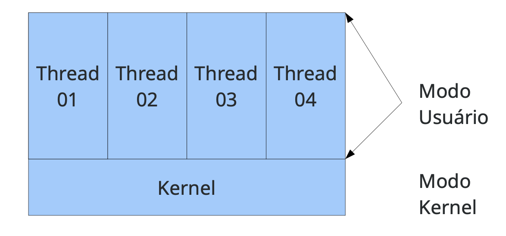

- Geralmente o escalonador do S.O é não-preemptivo
- Cada processo precisa de sua própria tabela de threads
- Threads manipuladas por funções
- Quando uma thread dor perder o controle, ela chama o procedimento do ambiente para selecionar outra thread
- Troca de contexto muito rápida entre as threads
- Cada processo pode ter seu próprio algoritmo de escalonamento
- Desvantagens
    - Muito cuidado ao usar chamadas bloquantes do sistema, elas rião bloquear todas as threads.
- A solução é colocar uma "capa" antes de todas as chamadas blocantes do sistema. Desta forma quando uma chamada blocante for realizada ela é mascarada pela biblioteca de threads que faz o teste de bloqueio
- Pacote POSIX threads

### Implementação de Threads em Modo Usuário

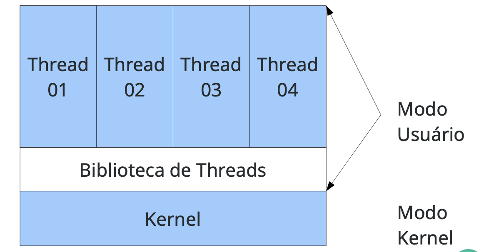

- Enquanto utilizar threads no espaço de usuário reduz o custo de troca, as operações de I/O exigem mais e podem bloquear as outras threads
- Implementar as threads em S.O continua inserindo um custo caro de troca de contexto

### Threads em Modo Híbrido

- Busca juntar as vantagens dos threads em modo kernel e modo usuário
- Um processo pode ter várias threads de kernel, por usa vez cada kernel pode conter diversar threads em modo usuário

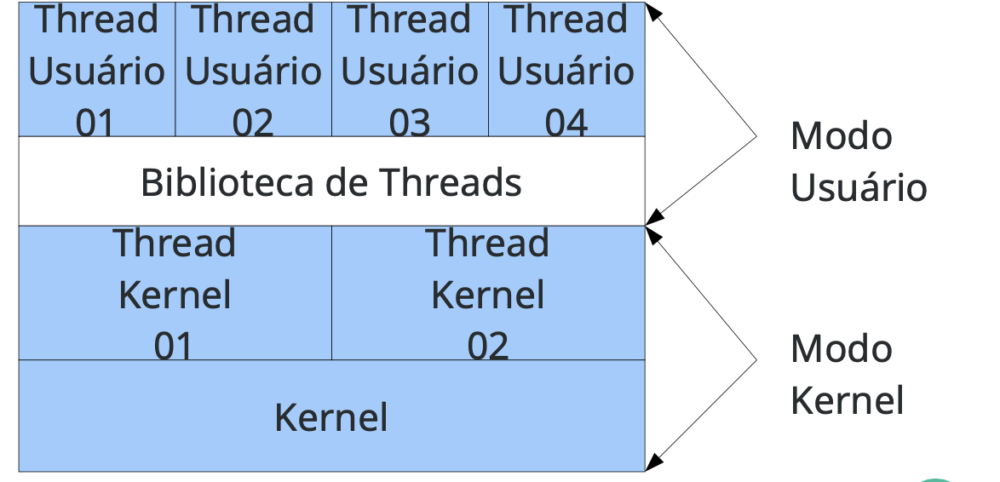

## Comparativo de threads em Diversos S.O

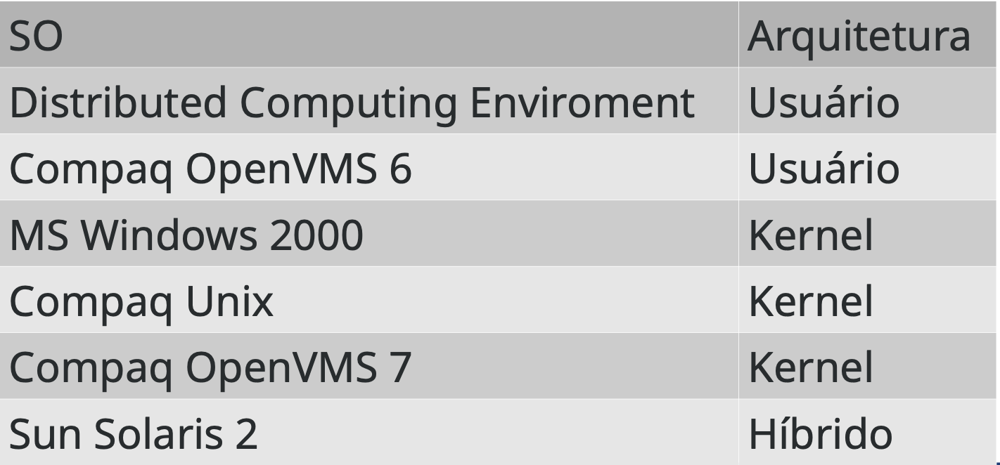

## Modelo de Execução de Threads

- Número de threads que queremos utilizar:
    - **Estática**: Não muda durante a execução, número **fixo**.
    - **Dinâmica**: Uma thread é criada para tratar cada requisição.

### Modelo Despachante/Trabalhador

- Uma thread dispachante é reposnável por receber trabalho, porém não processa
- O despachante seleciona uma thread trabalhadora para entregar o trabalho
- A trabalhadora executa a solicitação e sinaliza o despachante

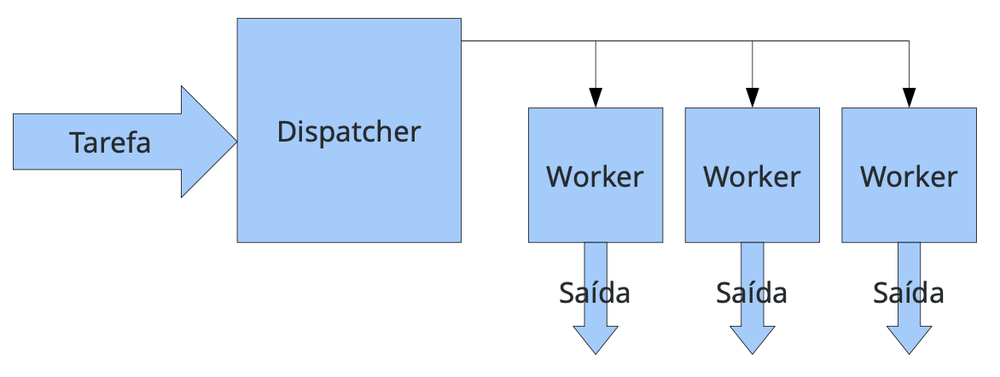

Um exemplo desse modelo é o servidor web, que pode sofrer várias requisições de diversos clientes, essas requisições podem envolver leitura de disco. Se a mesma thread recebe uma nova requisição e ler o disco, pode-se ter um problema.

#### Vantagens

- Consumo rápido de mensagens
- Boa distribuição das requisições
- flexibilidade, podemos mudar o número de threads de forma fácil

#### Desvantagens

- Pouco uso de CPU pela thread despachante
- por exemplo, de 4 threads trabalhadora e 1 despachante, em aglguns beanchmarks pode considerar apenas 80% do uso total de CPU.

### Modelo Time

Nesse modelo as threads são autônomas e gulosas por serviço, elas acessam um "poll" de tarefa, obtém e as executam.

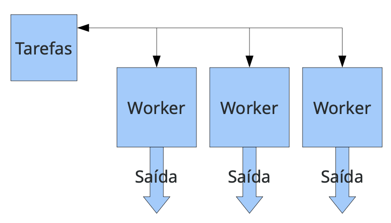

#### Vantagens

- Bom consumo de mensagens
- Boa distribuiçãi de mensagens
- Flexibilidade em mudar o número de tarefas

#### Desvantagens

- Cuidado na implementação, em alguns computadores modernos, uma thread inicia o programa de deve ser responsável por criar todas as outras, depois disso, ela deve se tornar uma thread normal do time.

### Modelo Pipeline

Nesse modelo, cada thread realiza uma tarefa específica produzinfo dados de entrada de outra thread, os dados de saída final são produzidos pela última thread.

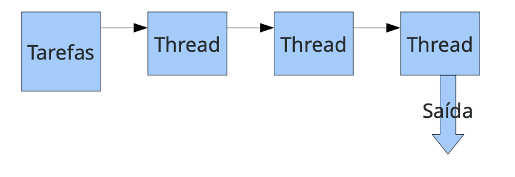

#### Desvantagens

- Se uma thread for muito mais lenta que as outras, todo o processamento é desperdição

- Muitas vezes não é fácil dividir a tarefa em um pipeline

-> qual a vantagem dela entre as outras

## A arte de Multiprogramar 2

Convertendo código monothread em código multithread é um tarefa difícil, especialmente com variáveis globais

Ex.:

- não-thread-safe

```c
int vetor[256];

int thread(int val, int pos){
    vetor[pos] = val;
}
```

- thread-safe

```c
int thread(int val, int pos){
    int vetor[256];
    vetor[pos] = val;
}
```

Dessa forma definidas variáveis globais em sistemas Unix e são amplamente utilizadas. Ex.: errno.

- Recebe dados via rede, verifica se vai bloquear

```c
while(1) {
    int len = recv(socket_client, buf, sizeof(buf), 0);
    if(len == -1){
        if(errno != EAGAIN && errno != EWOULDBLOCK) {
            ...
            return -1;
        }
    }
}
```

- Esse problema pode acontecer com chamadas de sistema, por exemplo, alocar uma região de 10 inteiros na memória para o programa. 
    - O probelma é, e se houver uma troca de contexto no meio da chamada? o malloc salva informações em uma tabela global de memórias
- Utilizar varáveis compartilhadas entre as threads **requer cuidado**.
- Em computadores modernos, a ordem de execução é definida pelo SO
- Algum desses problemas são conhecidas como **condições de Corrida**.

## Condição de Corrida

São também conhecidos como condições de disputa, como o SO determina através do seu escalonador como os processos irão executar, não sabemos a ordem que os processos podem executar.

- TROCAS DE CONTEXTO PODEM ACONTECER A QUALQUER MOMENTO!!

- Considere os seguintes processos/threads incremendando uma varável em memória compartilhada


- Considere, x = 0 inicialmente. Quais valores possíveis que x pode obter ao final? 

- Escalonamento: A -> B

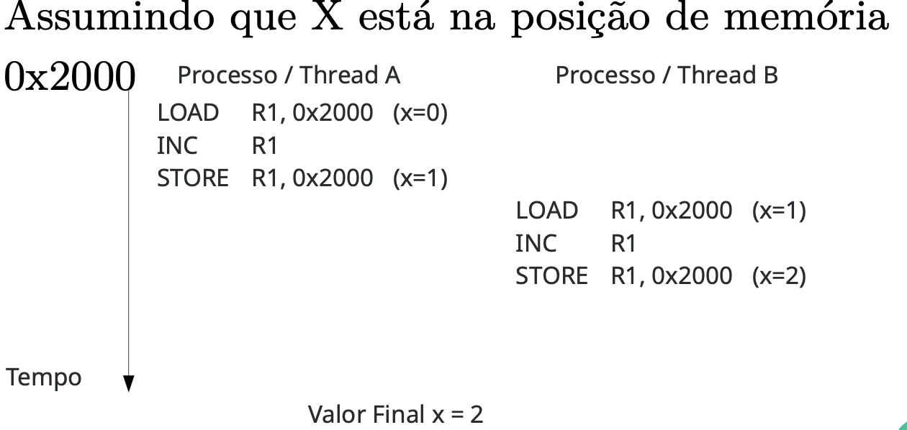

- Escalonamento: A -> B -> A


- Esse comportamento tede a ser bem indesejável, afinal na cabeça do programador "A variável X foi incrementada duas vezes"

- O debug dessas operações podem ser extremamente complexo.

## Condições de corrida 2

Imagina que um servidor de impressão enumere as vagas dos arquivos impressos 0, 1, 2, ...
- Uma variável next aponta para a próxima posição livre a ser impressa
- Imagina agoora que o processo A e B desejaram imprimir um arquivo e o servidor está com a seguinte configuração

- Escalonamento A -> B

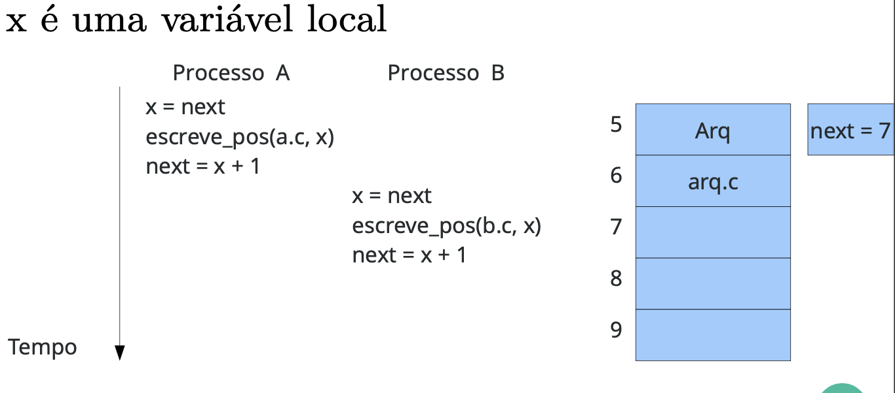

depois...

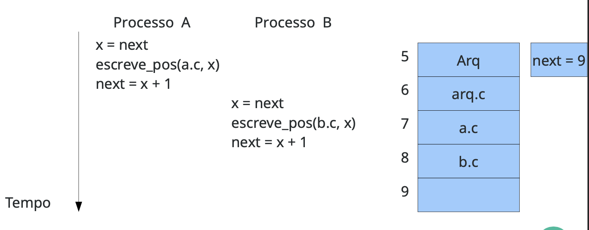

- Escalonamento A -> B -> A

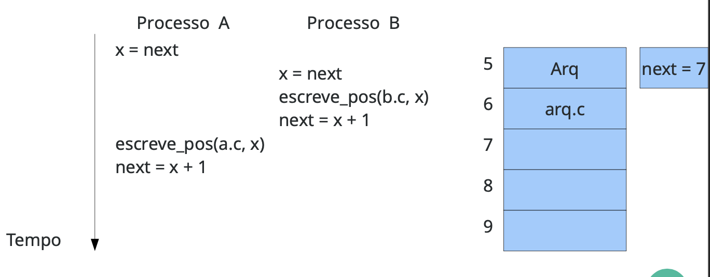

depois ...

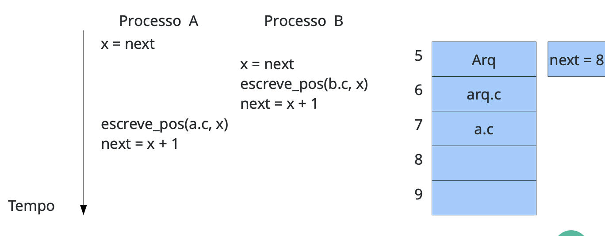

- Precisa-se assegurar que os processos que estejam trabalhando na mesma região de memória não sejam interrompidos, ou aguardem o término do outro processo antes de iniciar suas atividades. Esse processo é conhecido como **exclusão mútua**.

- O trecho de código que há acesso de leitura ou escrita à dados compartilhados é chamado de **seção crítica**.

- No primeiro exemplo a seção crítica é a operação de incremento, no segundo é toda a operação de escrever, a seção crítica normalmente é **MAIS** de uma instrução.

- Para evitar as condições de corrida, são colocadas funções antes de entrar e depois de sair da seção crítica.
- Essas funções utilizam diversas técnicas para impedir que os dois processos estejam simultaneamente na seção crítica e garantir a exclusão mútua.

```c
int thread(){
    while (true) {
        while (lock == 1) {}
        lock = 1;
        regiao_critica();
        lock = 0;
    }
}
```

