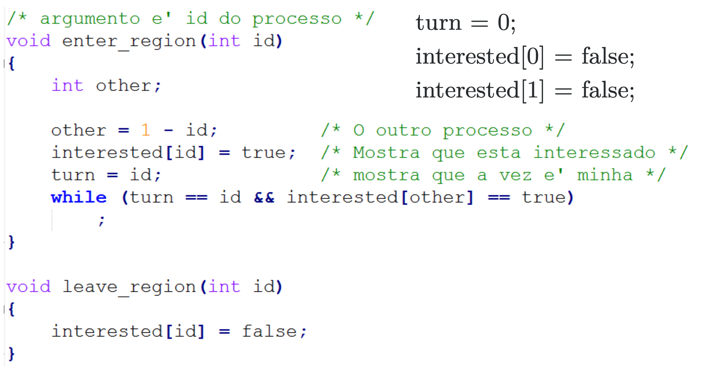

# Comunicação entre Threads

## Exclusão mútua

- Uma boa solução:
    - Nunca dois oricessis oidem estar simultaneamente em suas regiões críticas
    - Nada pode ser afirmado sobre a velocidade ou sobre número de CPUs
    - Nenhum processo executando fora de sua região crítica pode bloquear outros processos 
    - Nenhum processo deve esperar eternamente para entrar em sua região crítica

## Técnicas de implementação de exclusão mútua

- Inibir interrupções
- Com espera ocupada
- Com bloqueio de processos

## Inibir interrupções

- Se for possível desabilitar interrupções, um processo pode desabilitar e ligar antes e depois de acessar sua região crítica, respectivamente
- Um processo que desabilitou as interrupções não pode ser retirado a força da CPU, não é interrompido pelo escalonador
- Sendo assim, não há problemas de **acesso concorrentes**.

Porém, esse método possui consequências. Dentre elas:

- Ao inibir, um algoritmo garante todas as características.
- Se o programador esquece de habilitar as interrupções, não vai haver troca de contexto e o programa vai monopolizar a CPU. Deixando uma brecha muito grande para vírus.
- Função amplamente utilizada apenas em modo kernel, o programados no espaço de usuário não tem acesso à essa chamada.

## Espera ocupada

A espera ocupada, se chama "Busy Wait". O fato de utilizar a CPU para fazer teste de comparação.

- ```While (vez != minha) {};```
- Deve ser utilizada quando há uma expectativa de esperar um pouco/muito pouco
- Algumas vezes obrigatória em modo kernel

### Estrita Alternância

- Ela resolve o problema da exclusão mútua para dois processos
- É importante que os processos sejam parecidos
- O outro processo aguarda a saída

- Desvantagem: Não deve ser utilizada quando um processo é muito mais lento que o outro
- Ela viola a regra de um processo fora da seção crítica bloquaear outro processo

### Algoritmo de Peterson

- As threads devem ter identificador, com variável global que indica a vez de execução e um vetor que indica a intenção das threads
- Ele minimizou o número de loops e comporações necessárias
- Os processos possuem id único (0 ou 1)



> Olhar slides, tem explicacao de código

### Instrução TSL

- Neste caso, a instrução testa e altera um vlaor de maneira atômica (indivisível)
- Operações âtomicas são importantes em diversas áreas da computação
- Desta forma, podemos fazer um código parecido com as variáveis de impedimento

``` while (test_and_set(v) != 0 {})```

- A instrução TSL equivale logicamente a:
```
    while (lock == 0) {};
    lock = 1;
```

### Desvantagens da Espera Ocupada

- Deve ser utilizada em modo protegido ou quando a espera pelo lock for baixa
- Quando o tempo da espera, (valor da região crítica), demora menos de uma janela de timeslice, se sua fatia de tempo é maior que o tempo de esfera, não vale a pena usar bloqueio de processo.
- Existe o probelma de prioridades invertidas, quando utiliza-se um escalonador de prioridade estática.

#### Prioridade Invertida

- Quando colocamos threads com prioridades diferentes, e rodamos em Espera ocupada, imagina que eu tenho uma thread de prioridade baixa e uma de alta, quando o de baixa entra na seção crítica e o de alta começa a executar, o de alta vai tentar entrar na seção crítica, usando a CPU, chamando o escalonador, e entrando em loop. Pois o sistema vai pegar o de prioridade alta.
- **Não se** pode utilizar espera ocupada onde temos 2 processos de **prioridades diferentes**.


## Bloqueio de processos

O processo espera a permissão de entrada na seçao crítica e executa uma primitica, chamada de sistema que causa o seu bloqueio até que a seção crítica seja liberada

- ```if(vez != minha) wait_my_turn(vez);````
- O bloqueio ocasiona uma troca de contexto entre processos/threads e pode causa uma espera longa
- Chamadas blocantes podem ser não estar disponíveis em modo protegido

> Sexta entramos nisso