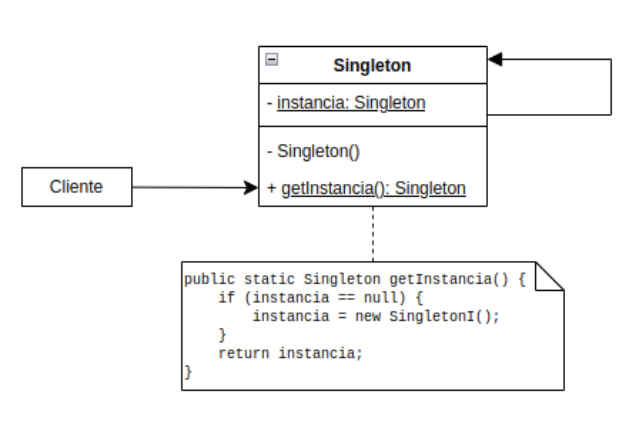
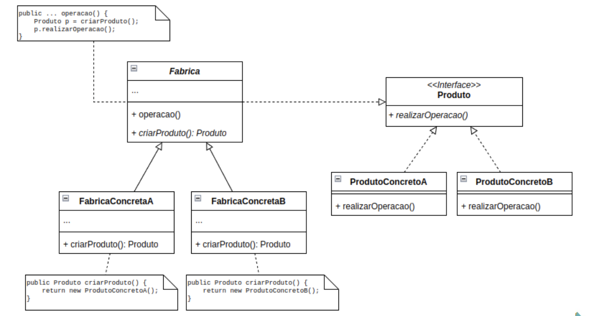
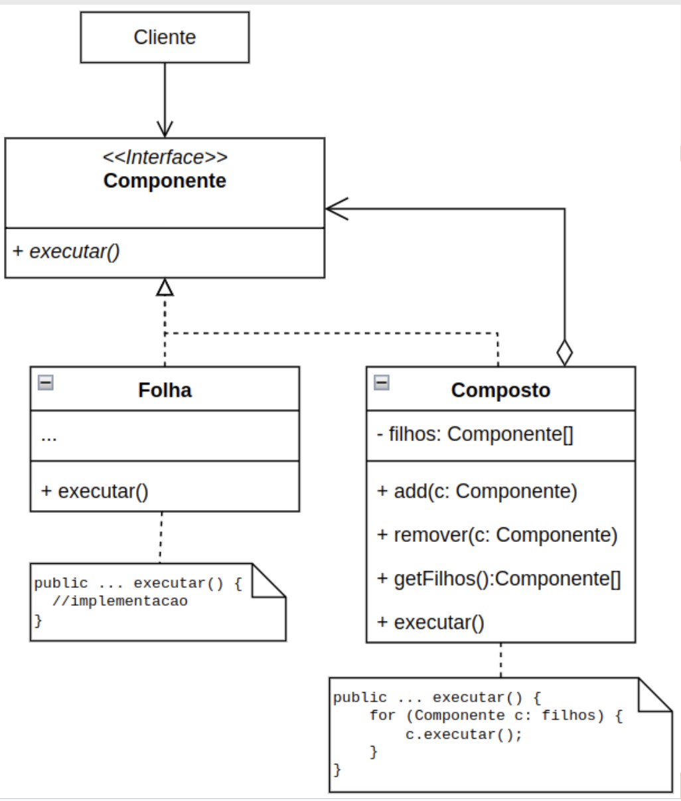

# Design Patterns GOF

São modelos returilizáveis que descrevem uma solução comprovada para um problema recorrente de design de software. São divididos em 3 categorias:

- **Criacionais**: Define mecanismos para a criação de objetos, tornando flexíveis as decisões de instanciação.
- **Estruturais**: Define maneiras para a composição de classes e objetos, para formar estruturas maiores e mais eficientes.
- **Comportamentais**: Define formas de comunicação e distribuição de responsabilidade entre onjetos que interagem entre si.

## Pra que usar?

- **Aprendizado**: Estudar padrões ajuda a entender os princípios de O.O e aplica-los de maneira correta e elegante.
- **Reutilização**: Eles fornecem um vocabulário comum para desenvolvidores, facilitando a comunicação e a reutilização de soluções comprovadas.
- **Qualidade do código**: Promovem um design de software mais limpo. flexível e fácil de manter.
- **Redução de erros**: Eles ajudam a evitar armadilhas comuns de projetos de software.

## Padrões Criacionais

### Singleton

O padrão **singleton** garante que uma classe tennha apenas uma única instância. É especialmente útil em situações em que a multiplicidade de instâncias pode levar à sobrecarga de recursos ou gestão inconsistente de estado.

#### Participantes

- **Classe principal**: Classe que vai inmplementar o método em sí.
- **Construtor privado**: Evita que álguem possa criar um obejto fora do controle da classe principal
- **Atributo estático**: Armazena a única instância da classe para que todas as partes da aplicação possam acessá-la.
- **Método de acesso**: Fornece um ponto de acesso centralizado para a instância única, o método getInstance() é chamado para obter a instância garantindo que só haja um ponto de acesso.

### Factory Method

Feio para resolver em problemas relacionados à criação de objetos e sua configuração. Ele abstrai do cliente a tarefa de instanciação, permitindo que a fábrica execute a criação de objetos de maneira consistente e flexível.

#### Participantes

- **Fábrica mãe**: Ponte de entrada para a criação de ordens de serviço.
- **Fábricas específicas**: Cada um é específico para cada tipo de componente.
- **Objetos**: Implementam funcionalidade específicas.

## Padrões Estruturais

### Composite 

Combina diversos objetos, em uma estrutura hierárquica fazendo com que um objeto se comporte como container de outros objetos.

#### Participantes

- Interface componente: Define a interface como a todos os elementos. 
    - **execute()** que será sobrescrito em cada classe.
- Folha: Classe que não possui subclasse padrão.
- Composto: Classe que realiza a agregação de elementos similares.
    - **add()** Adiciona algum componente ao agregado.
    - **remove()** Remove elemento do agregado.

