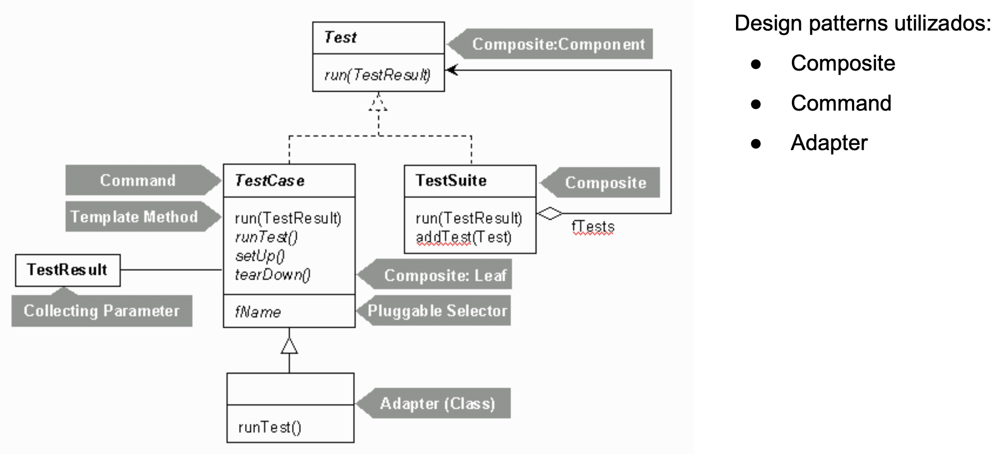

# Revisão Framework 

Definição: Teste unitário examina o comportamento de uma **unidade distinta** de trabalho:

- Métodos
- Classes
- Componentes de software

Testes são orientados a contratos de API: contrato de API é um acordo formal entre a unidade comportamental e quem chama, definido na forma: 

> Dado X como entrada, tem-se Y como saída

## Requisitos de xUnits

- Testes devem executar independentemente dos demais testes unitários:
    - Cada teste deve ser uma instância da classe de teste
    - Carregado por um *loader* diferente
- Framework deve detectar e reportar erros, teste por teste:
    - Para cado erro deve ser reportado o contexto em que ocorreu
- Deve ser fácil definir quais testes serão executados
    - Deve haver algum mecanismo capaz de informar ao *loader* quais métodos de teste a serem executados

## JUnit é um framework

> "A framework is a semi-complete application" (Martin Fowler)

Sendo JUnit um framework de teste unitários, como "completa-lo"?
- Escrevendo testes
- Agrupando testes
Como executar as funcionalidades do framework JUnit?
    - Executando testes 
        - Diversos modos de execução são oferecidos pelo JUnit

## Projeto estrutural - JUnit 4

### Test

- Define o tipo mais genérico (mais alto na hierarquia) das classes que compões a estrutura do Junit
- Desempenha o papel Component do padrão Composite.
- Especifica o método run (ie. define a assinatura) que será sobrescrito por suas subclasses.

### TestCase

- Um caso de teste é uma instância da classe TestCase
- É a classe folha (leaf) do padrão Composite
- Define a estutura de métodos a serem implementados para cada teste
    - SetUp
    - TearDown
    - RunTest
- Implementa o padrão TemplateMethod no método run

### TestSuite

- Desempenha o papel composto do padrão Composite
- Própria implementação do método run (herdado da classe Test) consiste em chamar o método run de cada um dos objetos que compõem a suíte de testes.
- Método addTest é chamado para adicionar instâncias de qualquer subclasse de Test à suíte de testes.

### TestResult

- Uma instância dessa classe é associada a cada um dos testes, através do parâmetro TestResult definido na assinatura do método run.
- É o responsável por capturar os resultados da execuções dos testes do caso de testes.

## Testes Simples

Estrutura típica de testes em JUnit

- Suíte de testes
    - Caso de teste
        - Testes
            - Asserções

Cada nível, nessa hierarquia, é uma composição de elementos do nível da camada imediatamente inferior.
    - Exceto suíte de testes

## Testando Exeções

- Testar se a unidade executa conforme esperado
- Testar se a unidade se comporta adequadamente em situações de falhas também é muito importante. 2 formas de testar o lançamento de exceções:
    - Teste **simples** de lançamento de exceções → verifica apenas se um objeto de exceção foi recebido pelo teste, sem considerar seus detalhes.
    - Teste **profundo** de lançamento de exceções → verifica:
        - O tipo de exceção lançada é, de fato, o tipo que se espera ser lançada;
        - Verifica se a mensagem de exceção é a que se espera;
        - Verifica o estado do objeto que lançou a exceção.

## Categoria de Testes

Categoria de testes são os rótulos que atribuímos aos testes que criamos.

- Em JUnit, cada categoria é definida através de uma interface JAVA
- Podem ser incluídas ou excluídas dos casos das suítes de teste
- Definidos por Categories.class

2 categorias:

- FuncionalidadesTestes  → para testes de funcionalidades sendo implementadas no projeto
- ExcecoesTestes → para testes de lançamentos de exceções 
- Criação / execução de suítes de testes com base nas categorias

## Testes com Timeout

Úteis para testar unidades que não podem demorar muito tempo para executarem ou que possuem tempo limite de resposta bem definido.  

Duas maneira de definir timeout:

- Para cada caso de teste isoladamente
    - Adiciona o tempo em milissegundos na anotação **@Test**
- Para todos os métodos do TestCase ou TestSuite
    - Define-se uma regra através da anotação **@Rule**
    - Em seguida instancia-se um objeto de **Timeout.class**

## Ignorando testes

O método de teste anotado com @Ignore não é considerado durante a execução do TesteCase ou TestSuite.

- Útil para marcar testes a serem implementados durante o desenvolvimento usando TDD. 
    - Testes isolados não influenciarão na prática TDD (barras verdes / vermelhas). 
